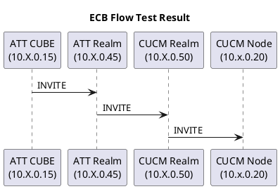

# ~={orange}01. CUBE CHANGE=~

- [ ] Active Calls to Minimun Impact

```bash
show sip calls summary
```

- [ ] Get Current Archive

```bash
dir | include Oct-1
```

```bash
cube02-hill-psc#dir | include Oct--1
32      -rw-            24707   Oct 1 2025 00:00:04 -04:00  config-archive--Oct--1-04-00-04.360-189
cube02-hill-psc#

```

```bash

cube02-halsey-nwk#dir | include Oct--1
29      -rw-            24376   Oct 1 2025 00:00:04 -04:00  config-archive--Oct--1-04-00-04.291-187
cube02-halsey-nwk#

```

```bash hlt:"config"
30      -rw-            24378  Sep 22 2025 00:00:04 -04:00  config-archive--Sep-22-04-00-04.362-173
```

```bash
cube02-halsey-nwk#dir | include Sep-23
34      -rw-            24377  Sep 23 2025 00:00:04 -04:00  config-archive--Sep-23-04-00-04.297-177
33      -rw-            24386  Sep 22 2025 20:04:19 -04:00  config-archive--Sep-23-00-04-19.744-176
32      -rw-            24386  Sep 22 2025 20:01:25 -04:00  config-archive--Sep-23-00-01-25.073-175
cube02-halsey-nwk#

cube02-hill-psc#dir | include Sep-23
36      -rw-            24705  Sep 23 2025 00:00:04 -04:00  config-archive--Sep-23-04-00-04.394-178
35      -rw-            24714  Sep 22 2025 20:17:02 -04:00  config-archive--Sep-23-00-17-02.715-177
34      -rw-            45846  Sep 22 2025 20:15:35 -04:00  config-archive--Sep-23-00-15-34.911-176
cube02-hill-psc#

```


- [ ] Initiate Stage

```
stage 30
```

- [ ] Remove Pattern 848445

```bash
voice class e164-pattern-map 1
no e164 +1848445....$
no e164 ^848445....$
```

Pre change

```bash
cube02-halsey-nwk#sh run | section voice class e164-pattern-map 1
voice class e164-pattern-map 1
 description **Inbound From ATT to CUBE - Outbound From CUBE to CUCM**
  e164 +1609652....$
  e164 +1609655....$
  e164 +1732235....$
  e164 +1732445....$
  e164 +1732447....$
  e164 +1732839....$
  e164 +1732932....$
  e164 +1732985....$
  e164 +1848267....$
  e164 +1848445....$
  e164 +1848932....$
  e164 +1856225....$
  e164 +1856785....$
  e164 +1908730....$
  e164 +1973353....$
  e164 +1973854....$
  e164 +1973972....$
  e164 +1833.......$
  e164 ^7327433200$
  e164 ^973913930.$
  e164 ^00000833.......$
  e164 ^848267....$
  e164 ^862313....$
  e164 ^848932....$
  e164 ^973972....$
  e164 ^973353....$
  e164 ^732745....$
  e164 ^856225....$
  e164 ^732235....$
  e164 ^732445....$
  e164 ^732839....$
  e164 ^732932....$
  e164 ^609652....$
  e164 ^609655....$
  e164 ^732447....$
  e164 ^732985....$
  e164 ^908730....$
  e164 ^973854....$
  e164 ^856785....$
  e164 ^848445....$
  e164 ^833.......$
 !
voice class e164-pattern-map 110
  e164 +18484456868
  e164 +18484456888
  e164 +18484457510
  e164 ^8484457510
  e164 ^8482671201
  e164 ^8482671202
  e164 ^8482671203
  e164 ^8482671204
  e164 ^8482671205
  e164 ^8482671206
  e164 ^8482671207
  e164 ^8482671208
  e164 ^8482671209
  e164 ^8482671210
  e164 ^8484456888
  e164 ^8484456868
  e164 ^8482676573
  e164 ^8484453026
  e164 ^84826712..
 !
cube02-halsey-nwk#

```


```bash
cube02-hill-psc#sh run | section voice class e164-pattern-map 1
voice class e164-pattern-map 1
 description **Inbound From ATT to CUBE - Outbound From CUBE to CUCM**
  e164 +1609652....$
  e164 +1609655....$
  e164 +1732235....$
  e164 +1732445....$
  e164 +1732447....$
  e164 +1732839....$
  e164 +1732932....$
  e164 +1732985....$
  e164 +1848267....$
  e164 +1848445....$
  e164 +1848932....$
  e164 +1856225....$
  e164 +1856785....$
  e164 +1908730....$
  e164 +1973353....$
  e164 +1973854....$
  e164 +1973972....$
  e164 +1833.......$
  e164 ^7327433200$
  e164 ^732509409.$
  e164 ^00000833.......$
  e164 ^848267....$
  e164 ^862313....$
  e164 ^848932....$
  e164 ^973972....$
  e164 ^973353....$
  e164 ^732745....$
  e164 ^856225....$
  e164 ^732235....$
  e164 ^732445....$
  e164 ^732839....$
  e164 ^732932....$
  e164 ^609652....$
  e164 ^609655....$
  e164 ^732447....$
  e164 ^732985....$
  e164 ^908730....$
  e164 ^973854....$
  e164 ^856785....$
  e164 ^848445....$
  e164 ^833.......$
 !
voice class e164-pattern-map 110
  e164 +18484456868
  e164 +18484456888
  e164 +18484457510
  e164 ^8484457510
  e164 ^8482671201
  e164 ^8482671202
  e164 ^8482671203
  e164 ^8482671204
  e164 ^8482671205
  e164 ^8482671206
  e164 ^8482671207
  e164 ^8482671208
  e164 ^8482671209
  e164 ^8482671210
  e164 ^8484456888
  e164 ^8484456868
  e164 ^8482676573
  e164 ^8484453026
  e164 ^84826712..
 !
cube02-hill-psc#

```


After change

```bash
cube02-halsey-nwk#sh run | section voice class e164-pattern-map 1
voice class e164-pattern-map 1
 description **Inbound From ATT to CUBE - Outbound From CUBE to CUCM**
  e164 +1609652....$
  e164 +1609655....$
  e164 +1732235....$
  e164 +1732445....$
  e164 +1732447....$
  e164 +1732839....$
  e164 +1732932....$
  e164 +1732985....$
  e164 +1848267....$
  e164 +1848932....$
  e164 +1856225....$
  e164 +1856785....$
  e164 +1908730....$
  e164 +1973353....$
  e164 +1973854....$
  e164 +1973972....$
  e164 +1833.......$
  e164 ^7327433200$
  e164 ^973913930.$
  e164 ^00000833.......$
  e164 ^848267....$
  e164 ^862313....$
  e164 ^848932....$
  e164 ^973972....$
  e164 ^973353....$
  e164 ^732745....$
  e164 ^856225....$
  e164 ^732235....$
  e164 ^732445....$
  e164 ^732839....$
  e164 ^732932....$
  e164 ^609652....$
  e164 ^609655....$
  e164 ^732447....$
  e164 ^732985....$
  e164 ^908730....$
  e164 ^973854....$
  e164 ^856785....$
  e164 ^833.......$
 !

```


```bash
voice class e164-pattern-map 1
 description **Inbound From ATT to CUBE - Outbound From CUBE to CUCM**
  e164 +1609652....$
  e164 +1609655....$
  e164 +1732235....$
  e164 +1732445....$
  e164 +1732447....$
  e164 +1732839....$
  e164 +1732932....$
  e164 +1732985....$
  e164 +1848267....$
  e164 +1848932....$
  e164 +1856225....$
  e164 +1856785....$
  e164 +1908730....$
  e164 +1973353....$
  e164 +1973854....$
  e164 +1973972....$
  e164 +1833.......$
  e164 ^7327433200$
  e164 ^732509409.$
  e164 ^00000833.......$
  e164 ^848267....$
  e164 ^862313....$
  e164 ^848932....$
  e164 ^973972....$
  e164 ^973353....$
  e164 ^732745....$
  e164 ^856225....$
  e164 ^732235....$
  e164 ^732445....$
  e164 ^732839....$
  e164 ^732932....$
  e164 ^609652....$
  e164 ^609655....$
  e164 ^732447....$
  e164 ^732985....$
  e164 ^908730....$
  e164 ^973854....$
  e164 ^856785....$
  e164 ^833.......$
 !
```

- [ ] Associate to new Pattern

```bash
voice class e164-pattern-map 110
e164 +1848445....$
e164 ^848445....$
```

After change 

```bash
cube02-halsey-nwk#sh run | section voice class e164-pattern-map 110
voice class e164-pattern-map 110
  e164 +18484456868
  e164 +18484456888
  e164 +18484457510
  e164 +1848445....$
  e164 ^8484457510
  e164 ^8482671201
  e164 ^8482671202
  e164 ^8482671203
  e164 ^8482671204
  e164 ^8482671205
  e164 ^8482671206
  e164 ^8482671207
  e164 ^8482671208
  e164 ^8482671209
  e164 ^8482671210
  e164 ^8484456888
  e164 ^8484456868
  e164 ^8482676573
  e164 ^8484453026
  e164 ^84826712..
  e164 ^848445....$
 !
cube02-halsey-nwk#

```


```bash
cube02-hill-psc#sh run | section voice class e164-pattern-map 1

voice class e164-pattern-map 110
  e164 +18484456868
  e164 +18484456888
  e164 +18484457510
  e164 +1848445....$
  e164 ^8484457510
  e164 ^8482671201
  e164 ^8482671202
  e164 ^8482671203
  e164 ^8482671204
  e164 ^8482671205
  e164 ^8482671206
  e164 ^8482671207
  e164 ^8482671208
  e164 ^8482671209
  e164 ^8482671210
  e164 ^8484456888
  e164 ^8484456868
  e164 ^8482676573
  e164 ^8484453026
  e164 ^84826712..
  e164 ^848445....$
 !
cube02-hill-psc#

```

sh run | section voice class e164-pattern-map 1

- [x] Test and Check Ladder Diagram on ECB




```ad-warning
Commit just if it works
```

- [x] Commit Changes

```bash
commit
```

- [x] Write Memory

```bash
wr
```


# ~={orange}02. CUCM Change=~

| ECB TRUNKS                                                                                                                                   |
| -------------------------------------------------------------------------------------------------------------------------------------------- |
| [trk_ecb01-3752-psc-sip-callmanager](https://ru-nwk-ucm-pub.rucm.rutgers.edu/ccmadmin/trunkEdit.do?key=8dedab32-ac5f-b869-7d65-09db50c4f06f) |
| [trk_ecb01-8725-nwk-sip-callmanager](https://ru-nwk-ucm-pub.rucm.rutgers.edu/ccmadmin/trunkEdit.do?key=c56a2a08-b9f6-96a1-a166-d3fc7ee1ce66) |
| ATT TRUNKS                                                                                                                                   |
| [trk-ru-nwk-cube-att](https://ru-nwk-ucm-pub.rucm.rutgers.edu/ccmadmin/trunkEdit.do?key=e7ba4455-8c66-dc6b-8823-bf5959667c3d)                |
| [trk-ru-psc-cube-att](https://ru-nwk-ucm-pub.rucm.rutgers.edu/ccmadmin/trunkEdit.do?key=2fd6679e-24d5-cdf1-7359-5cbb8990b890)                |

ATT TRUNK REACH FROM:

| Route Group                                                                                                                               | Changed | Tested | Description | Comments                                                                                                                                                                                                                                                                                                           | Test Call         |
| ----------------------------------------------------------------------------------------------------------------------------------------- | ------- | ------ | ----------- | ------------------------------------------------------------------------------------------------------------------------------------------------------------------------------------------------------------------------------------------------------------------------------------------------------------------ | ----------------- |
| [rg-ru-nb-pstn](https://ru-nwk-ucm-pub.rucm.rutgers.edu/ccmadmin/routeGroupEdit.do?key=0d711010-7d02-b78f-16a6-682425b258ab)              |         |        | psc, nwk    | This is one is just used as LRG on DP, Route List that admits SLRG are: rl-ru-psc-pstn(NOT RP Being Used) <br>& rl-ru-nwk-pstn most of the RP are Block patterns, just [\+.1973353XXXX1](https://ru-nwk-ucm-pub.rucm.rutgers.edu/ccmadmin/routePattern2Edit.do?key=ae8afedd-92fd-4430-d369-eed66b45da24) is in use | +197335312341     |
| [rg-cube-att-psc-nwk](https://ru-nwk-ucm-pub.rucm.rutgers.edu/ccmadmin/routeGroupEdit.do?key=3209c222-9db0-0b15-73cf-2bb746fa5e31)        |         |        | nwk, psc    | We need to hit [\+.1!](https://ru-nwk-ucm-pub.rucm.rutgers.edu/ccmadmin/routePattern2Edit.do?key=df00b012-5084-9332-4182-871f403ae1be) to send the call out                                                                                                                                                        | +19735551234      |
| [rg-E911-ECRCGroup](https://ru-nwk-ucm-pub.rucm.rutgers.edu/ccmadmin/routeGroupEdit.do?key=842d1e0d-9e3d-6dc9-aa8b-3a2aa58566fd)          |         |        | nwk, psc    | [922](https://ru-nwk-ucm-pub.rucm.rutgers.edu/ccmadmin/routePattern2Edit.do?key=22c14144-15b2-5c6d-ff33-9336de9a9940)                                                                                                                                                                                              | CHECK TOMORROW    |
| [rg-cube-att_OLD_WS-psc-nwk](https://ru-nwk-ucm-pub.rucm.rutgers.edu/ccmadmin/routeGroupEdit.do?key=d0764dcc-83a1-0705-3ecf-ddd6c43d936a) |         |        | psc, nwk    | [915](https://ru-nwk-ucm-pub.rucm.rutgers.edu/ccmadmin/routePattern2Edit.do?key=f2ffd589-87bb-91ba-882e-e853bfd750eb)                                                                                                                                                                                              | CHECK TOMORROW    |
| [rg-cube-att-only-nwk](https://ru-nwk-ucm-pub.rucm.rutgers.edu/ccmadmin/routeGroupEdit.do?key=f6229c7e-a04b-945d-0cef-06310e4eb712)       |         |        | nwk         | [\+.!](https://ru-nwk-ucm-pub.rucm.rutgers.edu/ccmadmin/routePattern2Edit.do?key=039af032-6d53-86c9-90cc-1fd33a07583e)                                                                                                                                                                                             | +9011573144762348 |
|                                                                                                                                           |         |        |             |                                                                                                                                                                                                                                                                                                                    |                   |

